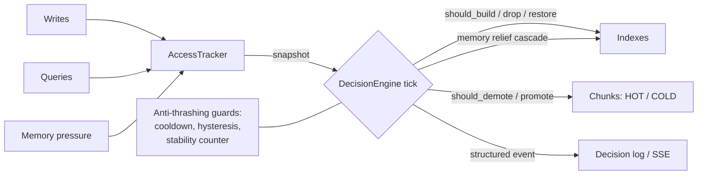

# Self-Balancing Storage

A prototype log storage engine that adapts its **indexes** and **storage tiers** to the workload it sees, instead of being configured in advance.

## The idea

Most log stores ask you to declare schemas, indexes and retention policies up front. This prototype takes the opposite approach: chunks of incoming logs are observed, and a control loop decides — for each chunk — which indexes to build, drop, or restore, and which chunks to move to a cold tier.

Two chunks of the same logical "table" can end up with very different physical layouts because they saw different queries. That is the property the demo shows as **per-chunk divergence**.

The control loop balances three signals — **predicate frequency** (what people actually query), **chunk temperature** (how hot the data is), and **memory pressure** (when to free memory) — with anti-thrashing protections (cooldowns, hysteresis, stability counters).

## How decisions are made

The decision engine runs on a periodic tick. On each tick it:

1. Takes a read-only snapshot of the tracker's metrics, so all decisions in the tick see a consistent state.
2. Walks through chunks and indexes and asks small pure functions like `should_build_index`, `should_drop_index`, `should_demote_chunk`. Each function looks at the snapshot, the chunk and the config, and returns a yes/no.
3. Collects the proposed actions, sorts them by priority and applies a budget per tick so the engine never spends too long on bookkeeping.
4. Anti-thrashing guards run before anything is applied: an index that was just dropped sits in cooldown, burst mode is entered/exited with hysteresis, and short-lived spikes have to stay stable for a few ticks before they cause action.
5. Each decision is logged as a structured event explaining *why* it was taken, so the engine's behaviour is observable, not magical.



## Versions

- **V1 — Core.** In-memory prototype with the chunk lifecycle, three index types, the access tracker and the decision engine. Single tier, single process, no persistence. The per-chunk divergence demo runs on V1.
- **V2 — Expansion.** Adds persistence (chunks on disk + WAL with recovery), hot/cold tiers, a small query language, an HTTP API and an event stream for observability.

## Installation

Requires Python 3.11+ and [uv](https://docs.astral.sh/uv/).

```bash
uv sync
```

## Running

End-to-end demo (writes, queries, burst, idle, recovery — all phases):

```bash
uv run python -m demo.full_v2_demo
```

Tests:

```bash
uv run pytest
```

Type-checking and lint:

```bash
uv run mypy self_balancing_storage
uv run ruff check
```

## Dashboard UI

The dashboard lives in `ui/` (React + TypeScript + Vite). It can run standalone against the FastAPI backend during development, or be built into `static/` and served by FastAPI on a single port.

### One-time setup

```bash
cd ui
npm install
```

### Development (two processes)

Backend:

```bash
uv run python -m self_balancing_storage.main
```

Frontend dev server (proxies `/api/*` to `:8000`):

```bash
cd ui
npm run dev
```

Open `http://localhost:5173`.

### Production build

```bash
cd ui
npm run build
```

The bundle is written to `static/` at the repo root. Then run only the backend:

```bash
uv run python -m self_balancing_storage.main
```

Open `http://localhost:8000`.

### Pages

- `/` — Overview: stat cards (write rate, burst ratio, memory pressure) with sparklines, chunks heatmap, recent decisions.
- `/chunks` — Filterable chunks list (grid or table).
- `/indexes` — Aggregated index stats, top predicates, sortable index table.
- `/decisions` — Full SSE-driven decisions feed with type filters.
- `/query` — Execute a parsed query and see results + latency.
